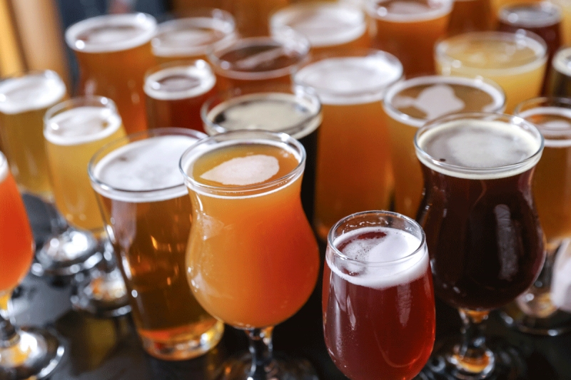
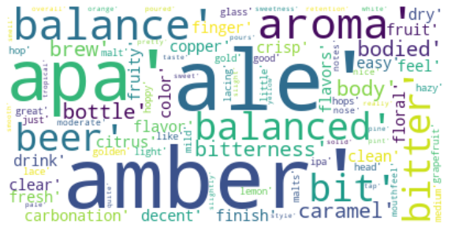

# Beer Recommender System

## What to drink next?

Once I moved to BC, I was overwhelmed by the number of beer brands available. 
I have always been a beer enthusiast and love to try new beers, but it was so hard to keep it up with the innovations.

According to Beer Advocate, the website that I scraped the data from, there are more than 300,000 beers listed.
There is no right answer to the number of beers available worldwide, but there is an estimate of more than a million beer brands available!
Wow, that’s quite a lot… According to the beer industry Canada, on average, we drink around 200 cans per year!! Based on the average consumption, it would take us almost 5,000 years to try all the beers available!
Knowing that we don’t have that time to try all the beers and find our favourite one, I have decided to build a Beer Recommender System  :)

## Tools and Packages that I used for this project:

#### Web Scraping:
* Scrapy
* requests

#### Feature Engineering:
* Natural language processing
* TFIDF

#### Modeling/Machine Learning

* Scikit-learn
* Tensor Flow/ Keras
* Numpy
* Pandas
* Surprise

#### Data visualization:
* Matplotlib
* Seaborn
* Dash/Plotly
* Google Embedding Projector - TSNE and PCA visualization

Feedback is always welcome :)

Cheers!
